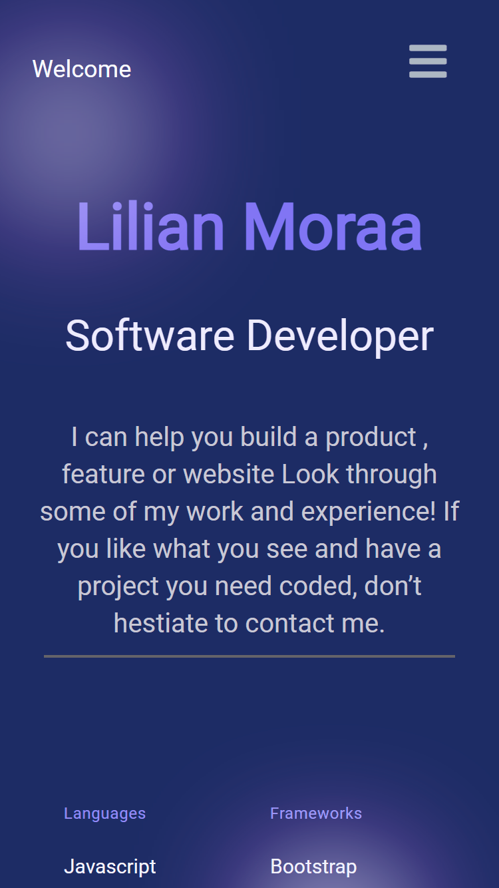
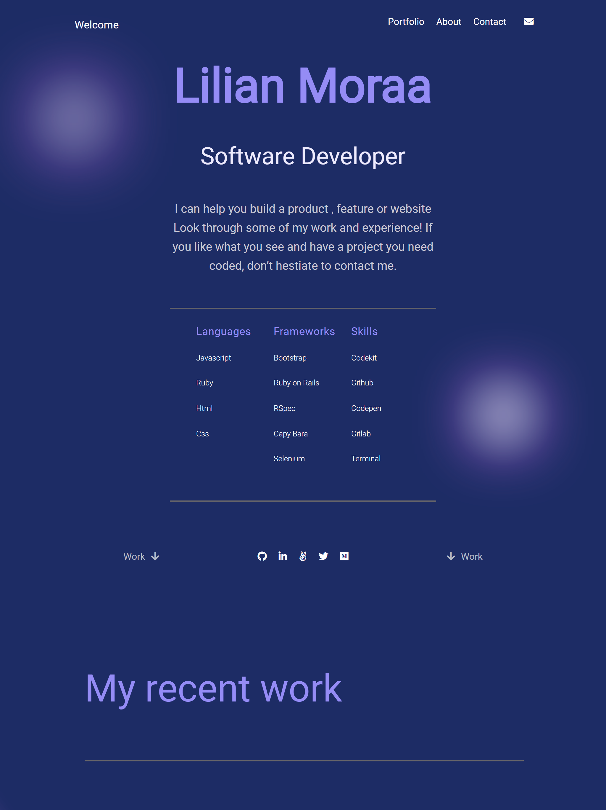

# Portfolio

> This is my portfolio webpage. In this section I am going to implement the mobile menu using my JavaScript knowledge to apply the following:
-When the user clicks (or taps) the hamburger button, the mobile menu appears.
-When the user clicks (or taps) the close (X) button, the mobile menu disappears.
-When the user clicks (or taps) any of the mobile menu options, the mobile menu disappears.
-When the user clicks (or taps) any of the mobile menu options, a correct part of the page is displayed.

- Below are the screenshots of my portfolio:

## Built With

- Html5 and Css3
- Javascript

## Live Demo

[Live Demo Link](https://lily-coder.github.io/myportfolio/)

### Setup
To get a local copy up and running follow these simple example steps.

- Clone the repository to your computer using git clone https://github.com/lily-coder/myportfolio.git
- Cd into the folder
- Open index.html with live server
- Or you can Fork it instead, and create a pull request to suggest some changes

## Authors

👤 **Author1**

- GitHub: [@githubhandle](https://github.com/lily-coder/lily-coder)
- Twitter: [@twitterhandle](https://mobile.twitter.com/LilianM53742529)
- LinkedIn: [LinkedIn](https://www.linkedin.com/in/lilian-moraa-99950b1b8)

## 🤝 Contributing

Contributions, issues, and feature requests are welcome!

Feel free to check the [issues page](../../issues/).

## Show your support

    Please give a⭐️if you love this project.
## Acknowledgments

- Hat tip to anyone whose code was used
- Inspiration
- etc

## 📝 License

This project is [MIT](./MIT.md) licensed.